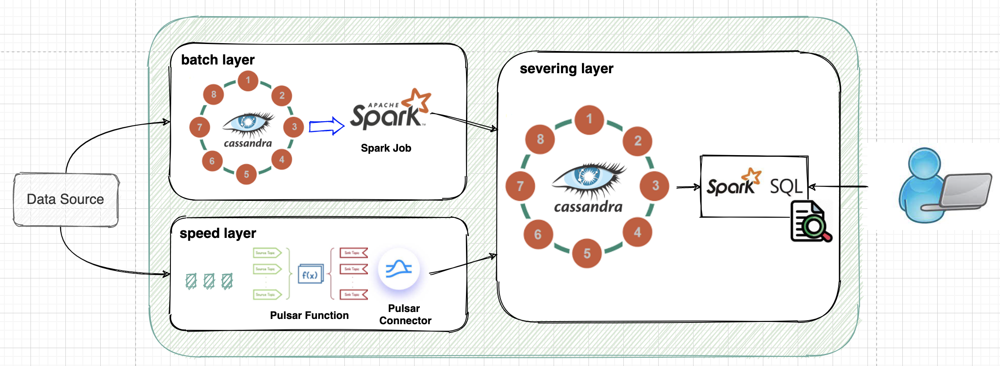

- [1. Overview](#1-overview)
  - [1.1. Demo Environment](#11-demo-environment)
  - [1.2. IoT Use Case Overview](#12-iot-use-case-overview)
    - [1.2.1. Raw Data Format](#121-raw-data-format)
- [2. Data Schema](#2-data-schema)
  - [2.1. C* Schema](#21-c-schema)
  - [2.2. Pulsar Schema](#22-pulsar-schema)
- [3. Demo Program Overview](#3-demo-program-overview)
  - [3.1. Pre-step: Create C* Keyspace and Table](#31-pre-step-create-c-keyspace-and-table)
  - [3.2. Step 1: Generate simulated workload file](#32-step-1-generate-simulated-workload-file)
  - [3.3. Step 2-1: Load the source data into the batch layer (raw data masterDB)](#33-step-2-1-load-the-source-data-into-the-batch-layer-raw-data-masterdb)
  - [3.4. Step 2-2: Publish the source data to the speed layer (a Pulsar topic)](#34-step-2-2-publish-the-source-data-to-the-speed-layer-a-pulsar-topic)
  - [3.5. Step 3: Run batch job to generate the batch view](#35-step-3-run-batch-job-to-generate-the-batch-view)
  - [3.6. Step 4-1: Deploy Pulsar function for real time stream processing](#36-step-4-1-deploy-pulsar-function-for-real-time-stream-processing)
    - [3.6.1. Deploy Pulsar Function](#361-deploy-pulsar-function)
  - [3.7. Step 4-2: Deploy Pulsar Cassandra sink connector to generate the real time view](#37-step-4-2-deploy-pulsar-cassandra-sink-connector-to-generate-the-real-time-view)
    - [3.7.1. Deploy DataStax Pulsar C* sink connector](#371-deploy-datastax-pulsar-c-sink-connector)


# 1. Overview

[Lambda architecture](https://en.wikipedia.org/wiki/Lambda_architecture) is a popular data-processing architecture pattern in addressing the challenges (such as latency, throughput, and latency) in the world of ***BIG*** data (or data lake). In this repository, I'm demonstrating how to implement the lambda architecture for a (simulated) IoT use case with several industry leading technologies that are best known for their capabilities in dealing with large amounts of data with large scale and high performance, either for batch-oriented data processing or real-time data processing.
* [Apache Cassandra (C*)](https://cassandra.apache.org/)
* [Apache Spark (Spark)](http://spark.apache.org/)
* [Apache Pulsar (Pulsar)](https://pulsar.apache.org/)

The high level architecture diagram of this implementation is as below:



By the above diagram,

* C* is used as the underlying storage mechanism for both the batch layer and the serving layer.
* Spark is used to do data loading and processing in batch mode from the batch layer to the serving layer.
* Pulsar is used as the underlying data processing and storage mechanism at the speed layer. 
  * Pulsar function can be used for more complex real time stream processing.
  * Pulsar Cassandra connector can be used to land the processed real time stream data into the serving layer.
* Through Spark SQL, the data of different views (batch and speed) and be queried by the end users in a powerful, robust yet flexible way.

## 1.1. Demo Environment

In this demo, for simplicity purposes, I'm using [DataStax Enterprise (DSE)](https://www.datastax.com/products/datastax-enterprise) as one unified platform for both C* storage and Spark processing. OSS C* and Spark can definitely be used here, but it requires setting up 2 separate clusters instead of only 1 DSE cluster.

The DSE version used in this demo is version **6.8.10**.

For Pulsar deployment, OSS Pulsar is used with version **2.7.1**.

## 1.2. IoT Use Case Overview

In this demo, we use a super simplified Oil Well drilling sensor IoT use case.
* Each drilling site can have multiple drills
* Each drill has 2 types of sensors. One for measuring drill temperature and another for measuring drill speed
* The drill sensor data is constantly being collected at a certain frequency (e.g. 1 second or 1 minute) and the collected data is fed into both the batch layer and the speed layer.

For the batch layer, the raw sensor data will be processed daily in order to generate different batch views for downstream analytical purposes. In this demo, one specific batch view is created for the following purpose:
* Get the average temperature and speed of all drills for every day.

For the speed layer, the raw sensor data will be processed in real time and only the messages of the most recent date will be kept because older data is already reflected in some batch views. The speed layer will then do further processing (e.g. filtering, transforming, or aggregating) of these data and generate real time views accordingly, depending on the downstream needs. 

In this demo, one specific real time view is created for the following purpose:
* Get the list of the drills that have the risk of either being too hot or spinning too fast for the current day.

### 1.2.1. Raw Data Format

In this simplified use case, the raw drill sensor data has the following format, expressed in [Apache Avro](http://avro.apache.org/) format (*[raw_sensor_data.avsc](./misc/raw_sensor_data.avsc)*):

```
{
  "type": "record",
  "name": "IotSensor",
  "namespace": "TestNS",
  "fields" : [
    {"name": "DrillID", "type": "string"},
    {"name": "SensorID", "type": "string"},
    {"name": "SensorType", "type": "string"},
    {"name": "ReadingTime", "type": "string"},
    {"name": "ReadingValue", "type": "float"}
  ]
}
```

---

# 2. Data Schema

In this demo, the following data schema (C* and Pulsar) is used for the above use case.

## 2.1. C* Schema

There are 3 C* tables needed for this demo. The CQL keyspace and table definition (*[drill_sensor.cql](./misc/drill_sensor.cql)*) is as below:

```
// Batch Layer - master DB
CREATE KEYSPACE IF NOT EXISTS master WITH replication = {'class': 'SimpleStrategy', 'replication_factor': 1 };
CREATE TABLE IF NOT EXISTS master.drillsensor_raw (
    drill_id text,
    sensor_id text,
    reading_date date,
    reading_time timestamp,
    sensor_type text static,
    reading_value float,
    PRIMARY KEY ((drill_id, sensor_id, reading_date), reading_time)
);


// Serving Layer - batch view
CREATE KEYSPACE IF NOT EXISTS batchview WITH replication = {'class': 'SimpleStrategy', 'replication_factor': 1 };
CREATE TABLE IF NOT EXISTS batchview.drill_info_by_date (
    drill_id text,
    reading_date date,
    sensor_type text,
    avg_value float,
    PRIMARY KEY ((drill_id, reading_date, sensor_type))
);


// Serving Layer - real time view
CREATE KEYSPACE IF NOT EXISTS realtimeview WITH replication = {'class': 'SimpleStrategy', 'replication_factor': 1 };
CREATE TABLE IF NOT EXISTS realtimeview.drill_warning_today (
    drill_id text,
    sensor_id text,
    reading_date date,
    reading_time timestamp,
    sensor_type text,
    reading_value float,
    PRIMARY KEY ((drill_id, sensor_id, reading_date), reading_time)
);
```

## 2.2. Pulsar Schema 

Pulsar has native schema support. In this demo, we're using the following Avro schema format (*[warning_sensor_data.avsc](./misc/warning_sensor_data.avsc)*) for the generated real time view data (warning sensor data).

```
{
  "type": "record",
  "name": "IotSensor",
  "namespace": "TestNS",
  "fields" : [
    {"name": "DrillID", "type": "string"},
    {"name": "SensorID", "type": "string"},
    {"name": "ReadingDate", "type": "string"},
    {"name": "ReadingTime", "type": "string"},
    {"name": "SensorType", "type": "string"},
    {"name": "ReadingValue", "type": "float"}
  ]
}
```

---

# 3. Demo Program Overview

In this demo, there are several programs/utilities that altogether form a complete end-to-end data processing flow following the lambda architecture:

| Item | Program | Description | Note | Location |
| ---- | ------- | ----------- | ---- | -------- |
| 1. | Workload Simulator | Generates a set of simulated drill sensor data in CSV format | Data Source | [workload_generator](./workload_generator) |
| 2. | Data bulk loading utility (*) | Load the raw sensor data into the raw data master DB | Batch Layer Data Loading |[DataStax Bulk Loader](https://docs.datastax.com/en/dsbulk/doc/index.html) |
| 3. | Pulsar producer | Publish the raw sensor data to a Pulsar topic | Speed layer Data Loading | [realtime_view/pulsar_producer](./realtime_view/pulsar_producer) |
| 4. | Pulsar function | Further real time stream processing to generate the real time view | Speed layer | [realtime_view/pulsar_function](./realtime_view/pulsar_function) |
| 5. | Daily batch job | Daily ETL job to generate the batch view from the raw data master DB | Batch layer  | [batch_view/daily_batch](./batch_view/daily_batch) |

**NOTE**: Other than the data loading utility (item 2), all other programs are custom made for the purpose of this demo.


With these programs and utilities, the high level end-to-end data processing flow is as below:

## 3.1. Pre-step: Create C* Keyspace and Table

Running the following command to create the C* keyspaces and tables that are needed for the demo.

```
$ cqlsh -f drill_sensor.cql
```

&#x2705; **Check Point**
```
3 empty tables should be created in C* without any data:
- master.drillsensor_raw
- batchview.drill_info_by_date
- realtimeview.drill_warning_today
```

## 3.2. Step 1: Generate simulated workload file

The main program, **WorkloadGen**, used for generating the workload file takes the following input parameters:

```
usage: WorkloadGen [-f <arg>] [-h] [-o <arg>]

WorkloadGen:
  -f,--config <arg> Configuration properties file.
  -h,--help         Displays this help message.
  -o,--output <arg> Output CSV file name.
```

Among these parameters, *-f/--config* specifies the configuration property file path that controls how the drill sensor data is generated, which has the following configuration properties. An example file can be found [here](./workload_generator/src/main/resources/generator.properties).

| Property Name | Description |
| ------------- | ----------- |
| drill_num | the total number of drills |
| sensor_types | the list of sensor types (separated by ',') |
| sensor_num_per_type | the number of sensors per type |
| workload_frequency | the frequency of one batch of the sample data records being generated. One batch of the sample data covers all sensors under all types for all drills |
| workload_period | the total time range within which the sample data will be generated per the specified frequency |
| workload_enddate | the end date of the simulated workload |

An example of running this program to generate a workload file is as below, assuming the generated Jar file name is *Workload_Generator-1.0-SNAPSHOT-all.jar*

```
$ java -jar Workload_Generator-1.0-SNAPSHOT-all.jar -f </path/to/generator.properties> -o </path/to/workload_gen.csv>
```

The generated workload file has content like below:

```
DRL-001,SNS-temp-01,temp,2021-04-05,2021-04-05T16:34:43,344.33
DRL-001,SNS-speed-02,speed,2021-04-05,2021-04-05T16:34:43,2963.67
DRL-002,SNS-temp-01,temp,2021-04-05,2021-04-05T16:34:43,394.68
DRL-002,SNS-temp-02,temp,2021-04-05,2021-04-05T16:34:43,243.21
DRL-003,SNS-speed-01,speed,2021-04-05,2021-04-05T16:34:43,2764.85
DRL-003,SNS-temp-02,temp,2021-04-05,2021-04-05T16:34:43,467.64
... ... 
```

&#x2705; **Check Point**
```
A CSV file with proper raw sensor data similar to the above is generated.
```

## 3.3. Step 2-1: Load the source data into the batch layer (raw data masterDB)
 
Using DataStax bulk loader command line utility to load data from a CSV into a C* table is very simple yet efficient. In this demo, the command to do the bulk loading is as below:

```
$ dsbulk load \
   -h <dse_server_ip> \
   -url <workload_file_path> \
   -k master -t drillsensor_raw \
   -header false \
   -m "0=drill_id, 1=sensor_id, 2=sensor_type, 3=reading_date, 4=reading_time, 5=reading_value" \
   --codec.timestamp CQL_TIMESTAMP
```

&#x2705; **Check Point**
```
raw data master DB (C* table "master.drillsensor_raw") should have all generated raw sensor data in it.
```

## 3.4. Step 2-2: Publish the source data to the speed layer (a Pulsar topic)

The main program, **SensorDataProducer**, used for publishing the generated workload file into a Pulsar topic takes the following input parameters:

```
usage: SensorDataProducer [-f <arg>] [-h] [-w <arg>]

SensorDataProducer options:
  -f,--config <arg>   Pulsar cluster connection configuration file.
  -h,--help           Displays this help message.
  -w,--workload <arg> Input workload source file.
```

Among these parameters, *-f/--config* specifies the configuration property file path that controls how the drill sensor data is generated, which has the following configuration properties. An example file can be found [here](./realtime_view/pulsar_producer/src/main/resources/pulsar.properties).

| Property Name | Description |
| ------------- | ----------- |
| web_svc_url | Pulsar HTTP(s) service URL |
| pulsar_svc_url | Pulsar broker service URL |
| topic_uri | Pulsar topic name that the workload is published to |
| authNEnabled | Whether Pulsar authentication is enabled |
| schema.type | Pulsar schema type. Currently only supports AVRO type or BYTE[] type (default) |
| schema.definition | Only applicable when the schema type is AVRO. This is the file path that defines the AVRO schema content |
| client.xxx | Pulsar client connection specific parameters |

An example of running this program to publish the workload to a Pulsar topic (e.g. persistent://public/default/raw_sensor_data) is as below, assuming the generated Jar file name is *SensorDataProducer-1.0-SNAPSHOT-all.jar*

```
$ java -jar SensorDataProducer-1.0-SNAPSHOT-all.jar -f </path/to/pulsar.properties> -w </path/to/workload_gen.csv>
```

In this demo, each message (raw sensor data) that is published to the Pulsar topic has a payload in JSON format, as below.

```
{ "DrillID": "DRL-001", "SensorID": "SNS-temp-01", "SensorType": "temp", "ReadingTime": "2021-04-05T17:10:22", "ReadingValue": 399.000000 }
```

&#x2705; **Check Point**
```
Pulsar topic "persistent://public/default/raw_sensor_data" should have messages that correspond to the generated raw sensor data.
```

## 3.5. Step 3: Run batch job to generate the batch view

At the batch layer, once the raw sensor data is stored in the master DB (e.g. **master.drillsensor_raw**), we can run a Spark job to simulate a batch job that runs regularly (e.g. daily). The Spark job can load, transform, aggregate, or do some other processing that satisfies the downstream analytical needs. 

The result of the Spark job in this demo is that the daily aggregated sensor data is written into a batch view table (e.g. **batchview.drill_info_by_date**) that we can check each drill's average temperature and speed per day.

The Spark job (written in *Scala*) expects the following properties to be defined in a file named **application.conf**. The content of this file is very straightforward, which defines the DSE server contact point IP address, source C* keyspace and table, as well as the target C* keyspace and table! 

```
conf {
    dse {
        contact_point_ip = "<dse_server_ip>"
        contact_point_port = 9042
    }

    source {
        ks_name = "master"
        tbl_name = "drillsensor_raw"
    }

    target {
        ks_name = "batchview"
        tbl_name = "drill_info_by_date"
    }
}
```

An example of running this Spark job for daily batch processing is as below, assuming the generated Jar file name is *dailybatch-assembly-1.0.jar*

```
$ dse spark-submit --master dse://<dse_server_ip>:9042 --deploy-mode cluster --class com.example.dailybatch dailybatch-assembly-1.0.jar
```

&#x2705; **Check Point**
```
batch view DB (C* table "batchview.drill_info_by_date") should have the daily average drill temperature and speed data up to one day before the current date.
```

## 3.6. Step 4-1: Deploy Pulsar function for real time stream processing

In this demo, the speed layer also needs to do further real time stream processing in order to get the most recent sensor data (up to the last daily batch point) such that the temperature and speed reading value is beyond a certain upper limit (aks, warning sensor data). 

In Pulsar, real time stream processing is achieved through Pulsar function. 

In this demo, a Pulsar function named *SensorWarnFilterFunc*, is developed to read each message from the input topic for raw sensor data (**persistent://public/default/raw_sensor_data**), filter it based on the message date/time and the reading value (to be higher than a threshold), and publish it to an output topic (**persistent://public/default/warning_sensor_data**).

&#x2705; **Check Point**
```
Pulsar topic "persistent://public/default/warning_sensor_data" should ONLY have messages that correspond to the most recent (the current date) with warning signs. Older sensor data or normal sensor data should NOT show up in this topic.
```

### 3.6.1. Deploy Pulsar Function

In this demo, the Pulsar function, assuming its Jar name is *SensorWarningFilter-1.0-SNAPSHOT-all.jar*, needs to be deployed in the Pulsar cluster before using it. One way to deploy it is through *pulsar-admin* CLI command, as below:

```
pulsar-admin functions create \
  --name SensorWarningFilter \
  --jar SensorWarningFilter-1.0-SNAPSHOT-all.jar> \
  --classname com.example.SensorWarnFilterFunc \
  --auto-ack true \
  --inputs persistent://public/default/raw_sensor_data \
  --output persistent://public/default/warning_sensor_data \
  --log-topic persistent://public/default/sensor_warning_filter_log
```

## 3.7. Step 4-2: Deploy Pulsar Cassandra sink connector to generate the real time view

Once the Pular function is successfully deployed, any raw sensor data that is published from the source (producer) will be automatically processed by this function on the fly. Any qualifying sensor data that is after the last daily batch processing and shows high temperature and speed values will be published to another Pulsar topic for further processing.

In this demo, these qualifying warning sensor data will be written to a real time view table (e.g. **realtimeview.drill_warning_today**).

Pulsar has a C* sink connector out of the box. But it has very limited functionality such that it can't handle data with complex schema. DataStax has offered an [enhanced version of Pulsar C* sink connector](https://github.com/datastax/pulsar-sink) that handles more complex types like AVRO schema type.

&#x2705; **Check Point**
```
real time view DB (C* table "realtimeview.drill_warning_today") should only have the daily warning sesnor data.
```

### 3.7.1. Deploy DataStax Pulsar C* sink connector

Use the following steps to deploy a DataStax (DS) Pulsar C* sink connector:

1. Download the latest DS Pulsar C* sink connector release([GitHub Repo](https://docs.datastax.com/en/pulsar-connector/1.4/index.html))

2. Put the unzipped NAR file (*cassandra-enhanced-pulsar-sink-1.4.0.nar*) into the following Pulsar binary subfolder and restart Pulsar servers
```
<PULSAR_HOMEDIR>/connectors/
``` 

3. Define a connector yaml file (example: [dse-sink.yaml](./misc/realtimeview/cass_sink/dse_sink.yaml)) that defines:
   * DSE client connection properties, such as for authentication, TLS encryption, etc.
   * Pulsar topic to C* keyspace/table mapping

4. Deploy the sink connector using *pulsar-admin* CLI command, as below:
```
pulsar-admin sinks create \
    --name sensor_warning_cass_sink \
    --sink-config-file `pwd`/dse_sink.yaml \
    --sink-type cassandra-enhanced \
    --tenant public \
    --namespace default \
    --inputs persistent://public/default/warning_sensor_data
```

Once the DS Pular C* sink connector is successfully deployed, any message that is published to the warning sensor topic will be automatically written into the real time view table. 
